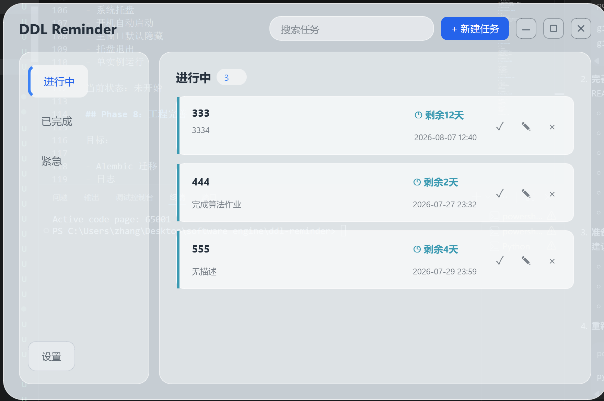
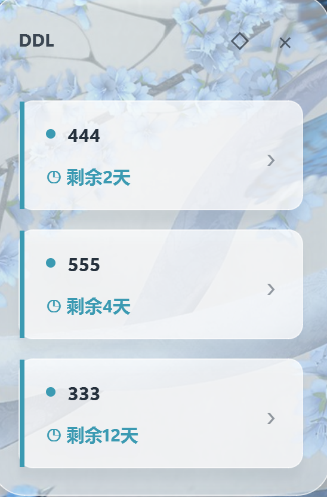
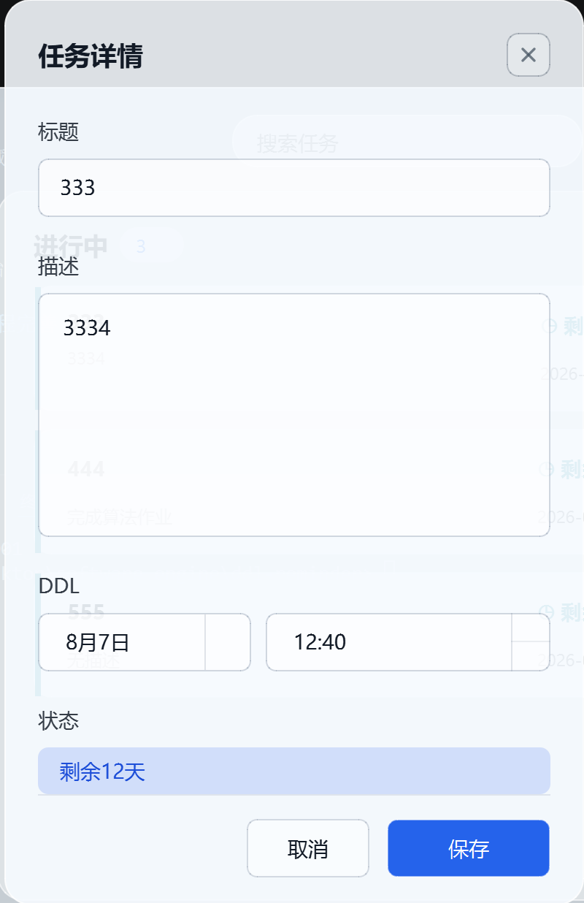

# DDL Reminder

DDL Reminder 是一个 Windows 桌面 DDL 提醒工具，用来让重要截止时间始终保持可见。

它把任务列表、轻量悬浮窗、Windows 通知、系统托盘和开机自启整合在一起。目标很简单：让紧急 DDL 不容易被忘记，同时不把应用做成笨重的效率套件。

## 截图

### 主窗口



### 悬浮窗



### 任务详情



## 功能

- 创建、编辑、完成、恢复和删除 DDL 任务
- 按进行中、已完成、紧急任务分开展示
- 悬浮窗显示最紧急的 3 个任务
- 显示剩余时间和逾期时间
- 到期前 24 小时提醒、到期前 1 小时提醒、逾期提醒
- 防止重复提醒
- Windows 系统托盘集成
- 单实例运行
- Windows 开机自启
- AppData 下的本地 SQLite 存储
- 使用 PyInstaller 打包 Windows 程序

## 技术栈

- Python 3.11+
- PySide6
- SQLAlchemy
- SQLite
- PyInstaller
- pytest

## 项目结构

```text
src/ddl_reminder/
  application/        # 用例服务
  domain/             # 领域模型和时间规则
  infrastructure/     # SQLite、通知、自启等
  ports/              # 接口定义
  ui/                 # PySide6 界面
  main.py             # 程序入口
tests/
  unit/
  integration/
docs/
  screenshots/
```

## 从源码运行

创建并激活虚拟环境：

```powershell
python -m venv .venv
.\.venv\Scripts\Activate.ps1
```

安装依赖：

```powershell
python -m pip install -e .
```

运行应用：

```powershell
python -m ddl_reminder.main
```

运行测试：

```powershell
python -m pytest
```

## 打包 Windows 程序

安装 PyInstaller：

```powershell
python -m pip install pyinstaller
```

打包：

```powershell
pyinstaller --noconfirm DDL-Reminder.spec
```

打包产物位于：

```text
dist/DDL-Reminder/DDL-Reminder.exe
```

## 数据位置

运行数据保存在：

```text
%APPDATA%/DDL-Reminder/
```

文件包括：

- `tasks.db`：本地 SQLite 数据库
- `ddl-reminder.log`：运行日志

## 文档

- [产品说明](docs/product.md)
- [架构说明](docs/architecture.md)
- [开发记录](docs/development-notes.md)
- [手动验收清单](docs/manual-test-checklist.md)
- [发布说明](docs/release.md)

原始过程文档保存在 [docs/archive](docs/archive/)。

## 当前状态

v0.1.0 是一个可用的本地 Windows 桌面版本。

已完成：

- 任务管理
- SQLite 持久化
- 主窗口
- 悬浮窗
- 提醒系统
- 系统托盘
- 单实例运行
- 开机自启
- PyInstaller 打包
- 自定义应用图标
- Inno Setup 安装器

后续可能改进：

- 添加数据库迁移支持
- 继续打磨 UI 细节
- 支持可配置提醒间隔

## License

MIT License.

---

# DDL Reminder

DDL Reminder is a Windows desktop app for keeping important deadlines visible.

It combines a task list, a lightweight floating window, Windows notifications, system tray integration, and autostart support. The goal is simple: make urgent DDLs hard to forget without turning the app into a heavy productivity suite.

## Screenshots

### Main Window


### Floating Window


### Task Detail


## Features

- Create, edit, complete, restore, and delete DDL tasks
- Separate active, completed, and urgent task views
- Floating window showing the three most urgent tasks
- Remaining-time and overdue-time display
- 24-hour reminder, 1-hour reminder, and overdue reminder
- Duplicate reminder prevention
- Windows system tray integration
- Single-instance app lock
- Windows autostart
- Local SQLite storage under AppData
- PyInstaller packaging
- Custom app icon
- Inno Setup installer for Windows

## Tech Stack

- Python 3.11+
- PySide6
- SQLAlchemy
- SQLite
- PyInstaller
- pytest

## Project Structure

```text
src/ddl_reminder/
  application/        # Use cases
  domain/             # Domain model and deadline rules
  infrastructure/     # SQLite, notifier, autostart, etc.
  ports/              # Interfaces
  ui/                 # PySide6 UI
  main.py             # App entry point
tests/
  unit/
  integration/
docs/
  screenshots/
```

## Run From Source

Create and activate a virtual environment:

```powershell
python -m venv .venv
.\.venv\Scripts\Activate.ps1
```

Install dependencies:

```powershell
python -m pip install -e .
```

Run the app:

```powershell
python -m ddl_reminder.main
```

Run tests:

```powershell
python -m pytest
```

## Package For Windows

Install PyInstaller:

```powershell
python -m pip install pyinstaller
```

Build:

```powershell
pyinstaller --noconfirm DDL-Reminder.spec
```

The packaged app is generated at:

```text
dist/DDL-Reminder/DDL-Reminder.exe
```

Build installer:

```powershell
iscc installer\DDL-Reminder.iss
```

The installer is generated at:

```text
installer_dist/DDL-Reminder-Setup.exe
```

## Data Location

Runtime data is stored under:

```text
%APPDATA%/DDL-Reminder/
```

Files:

- `tasks.db`: local SQLite database
- `ddl-reminder.log`: runtime log

## Documentation

- [Product Notes](docs/product.md)
- [Architecture](docs/architecture.md)
- [Development Notes](docs/development-notes.md)
- [Manual Test Checklist](docs/manual-test-checklist.md)
- [Release Notes](docs/release.md)

Original process documents are kept under [docs/archive](docs/archive/).

## Current Status

v0.1.2 is an installable local Windows desktop version.

Completed:

- Task management
- SQLite persistence
- Main window
- Floating window
- Reminder system
- System tray
- Single instance
- Autostart
- PyInstaller packaging
- Custom app icon
- Inno Setup installer
- Task creation dialog matches the task detail glass style

Next possible improvements:

- Add database migration support
- Polish UI details
- Add configurable reminder intervals

## License

MIT License.
